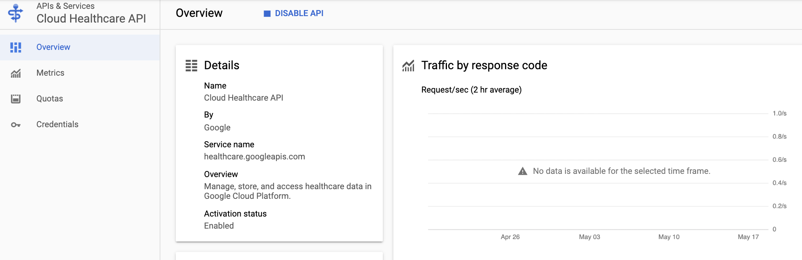

# Using Cloud Healthcare API with FHIR health record data

### Contents:

- Introduction
- Overview of Cloud Healthcare API
    - Platform-as-a-Service
    - Projects, datasets, and stores
    - BigQuery and Cloud Storage integration
    - Cloud Pub/Sub integration
- Activate Cloud Shell
- Start a new project
- Enable Cloud Healthcare API
- Create a FHIR dataset and a data store with Cloud Healthcare API
- Create a Cloud Storage bucket
- Set up IAM permissions
- Import a FHIR dataset to Cloud Storage
- Ingest the FHIR dataset to the data store
- Explore the dataset with BigQuery
- Additional sources for learning

## Introduction

This tutorial provides an overview of the [Cloud Healthcare API](https://cloud.google.com/healthcare/docs)—a managed solution for both storing and accessing healthcare data—on Google Cloud. 

You will learn about the API and how to ingest electronic health record data. The type of data you will be working with in this tutorial is called Fast Healthcare Interoperability Resources or [FHIR](https://cloud.google.com/healthcare/docs/concepts/fhir) and has been synthetically generated.

You will be interacting with the Cloud Healthcare API by using two tools for managing and interacting with Google Cloud services, namely:

- [_Google Cloud Console_](https://cloud.google.com/docs/overview#ways_to_interact_with_the_services): for interacting with Google Cloud via a graphical user interface in a browser. You can create, manage, and monitor any available Google Cloud services in Cloud Console.
- [_Google Cloud Shell_](https://cloud.google.com/shell/docs?hl=en): for command line and automation-based interactions with Google Cloud services. Cloud Shell is a browser-based shell that is both interactive and authenticated. Cloud Shell is a virtual machine loaded with development tools offering a persistent 5GB home directory. You can choose to interact with developer tools (for example, Python), text editors (including vim and nano), and other tools (such as git and pip).

## Overview of Cloud Healthcare API

Since 2018, Google Cloud and Google AI teams have been working with customers and partners to start to bring various healthcare-related tools into clinical workflow.

There are a myriad of problems in clinical decision-making. In both medical and non-medical data analysis practitioners spend a lot of time in data discovery, where they have to ingest the data into a system, store it, and then analyze it.

In the healthcare industry, you have various clinical IT systems that have been built over many years. Then, there are cloud solutions, such as Google Cloud, offering storage, insight and machine learning solutions for your data.

[Cloud Healthcare API](https://cloud.google.com/healthcare/docs) fills the gap between the healthcare sector's existing infrastructure and cloud services, such as Google Cloud, by providing a managed solution for both storing and accessing healthcare data.


(Source: Google Cloud Next 2019—Real-Time, Serverless Predictions With Google Cloud Healthcare API)

### Platform-as-a-Service

Cloud Healthcare API is a platform-as-a-service (PaaS) that supports formats and protocols that are native to the healthcare industry. And, because data security is paramount in healthcare, the API covers identity management, network security, audit logging, storage and encryption, among other features.

> There are mainly three types the healthcare industry works with: [FHIR](https://cloud.google.com/healthcare/docs/concepts/fhir), [HL7v2](https://cloud.google.com/healthcare/docs/concepts/hl7v2) or [DICOM](https://cloud.google.com/healthcare/docs/concepts/dicom). 
>
> FHIR, for example, is a very extensible data model. It is also a graph, which allows for graph-based querying and other technology use to work against that kind of data. And, FHIR is an API specification, which allows it to be not only labeling and training data—as in the case of machine learning—but also a [transactional target](http://www.hl7.org/implement/standards/fhir/http.html#transaction).
> 
> This tutorial covers handling FHIR data.

### Projects, datasets, and stores

Cloud Healthcare API is an API service, where you have you have a hierarchy ranging a **[project](https://cloud.google.com/healthcare/docs/concepts/projects-datasets-data-stores#projects)** to a **[dataset](https://cloud.google.com/healthcare/docs/concepts/projects-datasets-data-stores#datasets_and_data_stores)** (such as clinical images or messages) and, finally, to a **[data store](https://cloud.google.com/healthcare/docs/concepts/projects-datasets-data-stores#datasets_and_data_stores)**, which implements the API's modalities.

To demonstrate the hierarchy, let's take a look at a REST path to the API:

```HTML
https://healthcare.googleapis.com/<V>/projects/<P>/locations<L>/
datasets/<D>/<type>Stores/<S>
```

| Argument   | Description                            | Example                   |
| ---------- | -------------------------------------- | ------------------------- |
| `<V>`      | Healthcare API version                 | v1, v1beta1               |
| `<P>`      | Project identifier                     | myhealthcareapiproject    |
| `<L>`      | Data location storage identifier       | us-central1               |
| `<D>`      | Dataset identifier                     | mydataset                 |
| `<type>`   | Data type slug identifier              | fhir, hl7v2, dicom        |
| `<S>`      | Store identifier                       | myfhirstore               |

This tutorial does not cover Cloud Healthcare API with REST but you can learn more about it in the official guides, such as [this one](https://cloud.google.com/healthcare/docs/how-tos/datasets#creating_a_dataset) (click on API to see sample code).

#### BigQuery and Cloud Storage integration

Healthcare API can export data from its native data type—be it HL7v2 or FHIR—to Google Cloud's [BigQuery](https://cloud.google.com/bigquery/docs), which allows you to run SQL-based analysis against petabytes of data and get meaningful insights.

This means that you can import and export your medical data to BigQuery while storing it in a [Cloud Storage](https://cloud.google.com/storage/docs?hl=en) bucket.

#### Cloud Pub/Sub integration

In addition, every store in Cloud Healthcare API can be associated with a [Google Cloud Pub/Sub](https://cloud.google.com/pubsub/docs/) topic. When there is a change in data, it generates a notification to call Cloud Pub/Sub, which can trigger a number of notifications that other applications can subscribe to.

Cloud Pub/Sub is a publish/subscribe messaging service that allows users to send and receive messages between independent applications. You can learn about configuring Cloud Pub/Sub notifications when data changes in Cloud Healthcare API data stores [here](https://cloud.google.com/healthcare/docs/how-tos/pubsub).

## Activate Cloud Shell

Let's begin by activating Google Cloud Shell in [Cloud Console](console.cloud.google.com).

- Clicking the **Activate Cloud Shell** button (**>_**) on the top right toolbar:

<center></center>

- Then, click **Continue** in a new tab that appears in the bottom half of the screen. Your Cloud Shell should be ready.

> **Optional:** The gcloud interactive shell environment provides a richer `bash` experience with autocomplete and suggestions of text snippets. You can view full documentation [here](https://cloud.google.com/sdk/docs/interactive-gcloud). Before enabling gcloud interactive mode, check if you have the `gcloud beta components` installed with `gcloud components list`. You can also verify if the [Cloud SDK](https://cloud.google.com/sdk/docs) component manager is enabled and installed with `sudo apt-get install google-cloud-sdk`. Then, install beta components with `gcloud components install beta` and, finally, enter the gcloud interactive mode with the `gcloud beta interactive` command.

## Start a new project

The steps below will show you how to create a new project for your Cloud Healthcare dataset and data store.

### In Cloud Console

- Go to the **[Manage Resources](https://console.cloud.google.com/cloud-resource-manager)** page. 
- Select **Create Project**.

<center></center>

- In the **New Project** window, enter a project name. In this example, you'll be using "**myhealthcareapiproject**".

- Click **Create**.

- Your panel should look like this:

<center></center>

> **Note:** A project ID must start with a lowercase letter, and can contain only ASCII letters, digits, and hyphens, and must be between six and 30 characters. It is unique and when you choose it or any resource names, please do not include any sensitive information in them.

- Next, go to the [Dashboard](https://console.cloud.google.com/home) page, click **Select a project** from a drop-down list at the top of the page, and then click on your new project's name. If you have many projects you can use the search bar to find it.

<center></center>

### In Cloud Shell

- To create a new project, use the `gcloud projects create` [command](https://cloud.google.com/sdk/gcloud/reference/projects/create), followed by the project's new ID. You will be using `myhealthcareapiproject` in this example:

```bash
gcloud projects create myhealthcareapiproject
```

- Next, you set the project as your default project by using the `gcloud config set project` [command](https://cloud.google.com/sdk/gcloud/reference/config/set), followed by the project's ID:

```bash
gcloud config set project myhealthcareapiproject
```

## Enable Cloud Healthcare API

Next, you need to enable the API.

### In Cloud Console

- Under the **Navigation Menu**, go to **APIs & Services** > **Library**:

<center></center>

- You should be greeted with the "Welcome to the API library" message. 

> **Note:** If you see the **APIs and Services** dashboard, click **Enable APIs and Services**

- In the search bar enter "**healthcare API**".

<center></center>

- Click on **Cloud Healthcare API** and select **Enable**.

- You should be greeted with the Cloud Healthcare API panel:

<center></center>


> **Note:** Alternatively, you select **Healthcare** under **Big Data** in the **Navigation Menu** and you will greeted with a panel where you can select **Enable** to choose the API:

<center></center>

### In Cloud Shell

- In the command line interface you manage Cloud Healthcare API resources with `gcloud beta healthcare`. (you can view full documentation [here](https://cloud.google.com/sdk/gcloud/reference/beta/healthcare)).

- To enable the API run the following [command](https://cloud.google.com/sdk/gcloud/reference/services/enable):

```bash
gcloud services enable healthcare.googleapis.com
```

> **Note:** For more information on enabling APIs, see [documentation](https://cloud.google.com/endpoints/docs/openapi/enable-api). You can also read more about controlling who can enable your API [here](https://cloud.google.com/endpoints/docs/openapi/control-api-callers).

## Create a FHIR dataset and a data store with Cloud Healthcare API

Having created a project and enabled Cloud Healthcare API, the next steps are to create a dataset and a data store for your FHIR data.

> **Attention:** Consider local healthcare regulations about where to store the data and colocation of the healthcare dataset(s) to the data source, Cloud Storage bucket(s) and BigQuery dataset(s). A full list of considerations can be found in [documentation](https://cloud.google.com/healthcare/docs/concepts/regions#location_considerations).

### In Cloud Console

- Click on the **Navigation Menu** and under **Big Data** go to **Healthcare**:

<center></center>

- Select **Create Dataset**:

<center></center>

- Name the dataset. In this example, you will be using "**mydataset**".

- Choose a data center region for your project where Cloud Healthcare API is available (see the [full list of available locations](https://cloud.google.com/healthcare/docs/concepts/regions)). In this tutorial, you will be using `us-central1` (based in Iowa, USA).

<center></center>

- Click **Create**. 

- In the Cloud Healthcare panel you should see the name of your newly-created dataset—**"mydataset"**—under Datasets. Click on its name:

<center></center>

- You are now in **Dataset** > **Data Stores** view. Select **Create Data Store**:

<center></center>

- Under **Data Store Settings**:
    - Select type **FHIR**. 
    - Choose a unique ID, such as "**myfhirstore**" (only numbers, letters, underscores, hyphens, and periods are allowed).

- Under **FHIR Store Configuration**, select **STU3**.

> **Note:** The FHIR version of a FHIR store can be DSTU2, STU3, or R4. You can read about STU3 [here](https://www.hl7.org/fhir/STU3/) and example the version history [here](https://www.hl7.org/fhir/history.html).

- Your configurations should look as follows:

<center></center>

- Click **Create** and notice that your new data store is now listed in the panel.

### In Cloud Shell

- To create a dataset use the `gcloud beta healthcare datasets create` [command](https://cloud.google.com/sdk/gcloud/reference/healthcare/datasets/create). You should specify the region where the data will be stored with the `--location` argument. In this example, the name is `mydataset` and region—`us-central1`:

```bash
gcloud beta healthcare datasets create mydataset \
    --location=us-central1
```

- You should see `Created dataset [mydataset]` in the output. Next, create a data store for your FHIR data using the `gcloud beta healthcare fhir-stores create` [command](https://cloud.google.com/sdk/gcloud/reference/beta/healthcare/fhir-stores/create) with a `--dataset` argument for the Cloud Healthcare dataset (`mydataset`). The name of the store in this example is `myfhirstore`:

```bash
gcloud beta healthcare fhir-stores create myfhirstore \
    --dataset=mydataset \
    --version=stu3
```

- It may take a few minutes to finish. Your output should say `Created fhirStore [myfhirstore]`.

> **Note**: You can find full documentation on creating and managing datasets with Cloud Healthcare [here](https://cloud.google.com/healthcare/docs/how-tos/datasets). For more on FHIR stores, see this [page](https://cloud.google.com/healthcare/docs/how-tos/fhir).

## Create a Cloud Storage bucket

You now need to create a Cloud Storage bucket where you can import electronic health record data. Later, you will ingest that data from your bucket to the FHIR store.

### In Cloud Console

- Select **Storage** under the **Storage** topic in the **Navigation Menu**:

<center></center>

- Click **Create Bucket**:

<center></center>

- Set the name to something unique and the region to `us-east1`. You can read the bucket naming guidelines [here](https://cloud.google.com/storage/docs/naming).

<center></center>

- Click **Create**.

### In Cloud Shell

- Let's set global variables to project ID, project number, region, dataset and data store names:

```
export PROJECT_ID=$(gcloud config list --format 'value(core.project)')
export PROJECT_NUMBER=$(gcloud projects list --filter="${PROJECT_ID}" --format="value(PROJECT_NUMBER)")
export REGION=us-central1
export DATASET_ID=mydataset
export FHIR_STORE_ID=myfhirstore
```

- Make a new Cloud Storage bucket with the `gsutil mb` [command](https://cloud.google.com/storage/docs/gsutil/commands/mb). You specify the project with the `-p` argument, the location—with the `-l` argument (here, we are using `us-east1`), and the unique bucket name goes after `gs://`:

```bash
gsutil mb -p myhealthcareapiproject -l us-east1 gs://myfhirbucketunique1
```

> **Note:** Alternatively, you can run the previous command by replacing the project's name with `$PROJECT_ID`:
>
> `gsutil mb -p $PROJECT_ID -l us-east1 gs://myfhirbucketunique1`

- Set the variable of your unique bucket name to `BUCKET_ID`:

```bash
export BUCKET_ID=myfhirbucketunique1
```

## Set up IAM permissions

Your next step is to set up appropriate permissions for Cloud Healthcare API to enable working with Cloud Storage and BigQuery.

### In Cloud Console

- Under the **Navigation Menu**, go to **IAM & Admin**:

<center></center>

- In the **IAM** panel where it says **Permissions for project "{PROJECT_ID}"** scroll down or use keyword search to find the word "**healthcare**" in the **Member** column. You should locate the Cloud Healthcare service agent name with the account domain **@gcp-sa-healthcare.iam.gserviceaccount.com**.

- Select the **pencil icon** to the right of the service agent's name to start editing permissions. 

<center></center>

- In the **Edit Permissions** window add two new roles under **Select a Role** separately: **Storage Object Admin** and **BigQuery Admin**:

<center></center>

- Click **Save** to confirm changes.

### In Cloud Shell

- You can update the permissions with the `gcloud projects add-iam-policy-binding` [command](https://cloud.google.com/sdk/gcloud/reference/projects/add-iam-policy-binding). The required flags are `--member` and `--role`. You are using a service account that used the `gcp-sa-healthcare.iam.gserviceaccount.com` (for Cloud Healthcare) for the former and the Cloud Storage administrator role—`roles/storage.admin`—for the latter:

```bash
gcloud projects add-iam-policy-binding $PROJECT_ID \
    --member=serviceAccount:service-$PROJECT_NUMBER@gcp-sa-healthcare.iam.gserviceaccount.com \
    --role=roles/storage.admin    
```

- Notice that in the output `roles/storage.admin` is now listed as a permission:

```
Updated IAM policy for project [{PROJECT_ID}].
bindings:
...
- members:
  - serviceAccount:service-$PROJECT_NUMBER@gcp-sa-healthcare.iam.gserviceaccount.com
  role: roles/storage.admin
...
```

- Update a permission for BigQuery, which you will be using later. Note that you are setting the the BigQuery administrator role permission here with `roles/bigquery.admin`:

```bash
gcloud projects add-iam-policy-binding $PROJECT_ID \
    --member=serviceAccount:service-$PROJECT_NUMBER@gcp-sa-healthcare.iam.gserviceaccount.com \
    --role=roles/bigquery.admin
```

- The output should confirm the permission has been added:

```
...
- members:
  - serviceAccount:service-$PROJECT_NUMBER@gcp-sa-healthcare.iam.gserviceaccount.com
  - user:{YOUR_USER_ACCOUNT}
  role: roles/bigquery.admin
...
```

## Import a FHIR dataset to Cloud Storage

Having created your Cloud Storage bucket, your next step is to import health record data to Cloud Storage. Following that, you can ingest the data from the bucket to the FHIR store with Cloud Healthcare API.

In this example, you will be using a public dataset called **the Synthea Generated Synthetic Data in FHIR**. It is a very large dataset with over 1 million synthetic patient records generated using Synthea in FHIR format.

First, you will be moving it to the bucket from another existing Google Cloud bucket that hosts the dataset. Then you can ingest it into the data store you created earlier with Cloud Healthcare API.

It is recommended to use just Cloud Shell in this section of the tutorial:

### In Cloud Shell

- Use the `gsutil cp` [command](https://cloud.google.com/storage/docs/gsutil/commands/cp) to copy the dataset from the internal Google Cloud bucket to your bucket. The public dataset is stored at `gs://gcp-public-data--synthea-fhir-data-1m-patients`:

```bash
gsutil cp gs://gcp-public-data--synthea-fhir-data-1m-patients gs://$BUCKET_ID.
```

The copying process may take a while to complete.

> **Note:** If this process takes too long to finish because of the size of the dataset, you can generate your own dataset of synthetic electronic health records by following the steps on the Synthea project's GitHub [here](https://github.com/synthetichealth/synthea). In addition, it is covered in detail on Cloud Healthcare API's documentation [site](https://cloud.google.com/healthcare/docs/how-tos/fhir-import-export#generating_simulated_patient_data_for_dstu2_or_stu3). And, if you want to interact with a smaller dataset, you can also request it by email by following the steps in [this Codelab](https://codelabs.developers.google.com/codelabs/fhir-to-bq/index.html?index=..%2F..index#1) for Google Developers (Last updated: April 28, 2020).

## Ingest the FHIR dataset to the data store

Now that you have the data in the Cloud Storage bucket, you can call the Cloud Healthcare API to load the sample FHIR data into your FHIR store. 

It is recommended to use just Cloud Shell in this section of the tutorial:

### In Cloud Shell

- Use the `gcloud beta healthcare fhir-stores import gcs` [command](https://cloud.google.com/sdk/gcloud/reference/beta/healthcare/fhir-stores/import/gcs) to import the FHIR data from your existing Cloud Storage bucket to the FHIR data store that you created earlier:

```bash
gcloud beta healthcare fhir-stores import gcs $FHIR_STORE_ID --dataset=$DATASET_ID --location=$REGION --gcs-uri=gs://$BUCKET_ID
```

> **Note:** This can be a lengthy process and you can monitor the progress in the Cloud Healthcare panel under **Dataset** > **Operations**:

<center></center>

## Explore the dataset with BigQuery

The **Synthea Generated Synthetic Data in FHIR** dataset is already available in [BigQuery](https://cloud.google.com/bigquery/docs). With over 1 million synthetic patient health records, you can explore the entire dataset even if you have a free tier Google Cloud account.

### In Cloud Console

- Click on the **Navigation Menu** and under **Big Data** go to **BigQuery**:

<center></center>

- On the left hand side next to **Resources** click **Add Data** and then choose **Explore public datasets**.

<center></center>

- Type **FHIR** in the search bar, press Enter, and select the Synthea dataset:

<center></center>

- Click **View Dataset**.

<center></center>

- On the left hand size of the BigQuery panel, navigate to **`bigquery-public-data`** > **`fhir_synthea`**. This is the Synthea Generated Synthetic Data in FHIR dataset.

- Click on the **`medication request`** table. Then, select **Details**:

<center></center>

- Notice that this table is almost 7 GB in size.

- Run a SQL query in the BigQuery editor to find out which patients have a hypertension or diabetes diagnosis, or both, that have received more than 7 medications. This is an official BigQuery example that you can find [here](https://console.cloud.google.com/bigquery?sq=1002644616445:d3f32c6bf9d94c6ab65b6fb9999b70f9):

    - You will query patients from `Condition` table and aggregate by required conditions. 

    - `JOIN` results with `Patient` and `MedicationRequest` table. 
    
    - The count will be for the total amount of medication requests per patient and limit it by 7.

```sql
SELECT 
  MR.patientId, 
  P.last_name,
  ARRAY_TO_STRING(P.first_name, " ") AS First_name,
  Condition.Codes, 
  Condition.Conditions,
  MR.med_count
FROM
  (SELECT 
    id, 
    name[safe_offset(0)].family as last_name, 
    name[safe_offset(0)].given as first_name, 
    TIMESTAMP(deceased.dateTime) AS deceased_datetime 
  FROM `bigquery-public-data.fhir_synthea.patient`) AS P
JOIN
  (SELECT  subject.patientId as patientId, 
           COUNT(DISTINCT medication.codeableConcept.coding[safe_offset(0)].code) AS med_count
   FROM    `bigquery-public-data.fhir_synthea.medication_request`
   WHERE   status = 'active'
   GROUP BY 1
   ) AS MR
ON MR.patientId = P.id 
JOIN
  (SELECT 
  PatientId, 
  STRING_AGG(DISTINCT condition_desc, ", ") AS Conditions, 
  STRING_AGG(DISTINCT condition_code, ", ") AS Codes
  FROM(
    SELECT 
      subject.patientId as PatientId, 
              code.coding[safe_offset(0)].code condition_code,
              code.coding[safe_offset(0)].display condition_desc
       FROM `bigquery-public-data.fhir_synthea.condition`
       wHERE 
         code.coding[safe_offset(0)].display = 'Diabetes'
         OR 
         code.coding[safe_offset(0)].display = 'Hypertension' 
    )
  GROUP BY PatientId
  ) AS Condition
ON MR.patientId = Condition.PatientId
WHERE med_count >= 7 
AND P.deceased_datetime is NULL /*only alive patients*/
GROUP BY patientId, last_name, first_name, Condition.Codes, Condition.Conditions, MR.med_count
ORDER BY last_name
```

- You can use this [link](https://console.cloud.google.com/bigquery?sq=1002644616445:d3f32c6bf9d94c6ab65b6fb9999b70f9) to run this Google Cloud query automatically. Note that it took less than 1 second to process 1.3 GB of data:

<center></center>

Overall, there should be 272,372 synthetic data points in the results, including 213,162 with hypertension, 23,472 with diabetes, and 35,738 with both.

> **Note:** SQL is a rich language and BigQuery offers many options to explore massive datasets. You can learn more about how to use the service in the **How-to guides** section of documentation [here](https://cloud.google.com/bigquery/docs/how-to). You can also follow BigQuery tutorials [here](https://cloud.google.com/bigquery/docs/tutorials).

## Additional sources for learning

- Synthea: Massive FHIR Data (2018)—[presentation](https://www.devdays.com/wp-content/uploads/2019/03/DD18-EU-Jason-Walonoski-Synthea-Massive-FHIR-Data-2018-11-15.pdf)—by the Mitre Corporation—the provider of the FHIR 1 million dataset you used in this tutorial and that's readily available in BigQuery. 
- Google Developer [Codelab](https://codelabs.developers.google.com/codelabs/fhir-to-bq/index.html?index=..%2F..index#1) (Last updated: April 28, 2020).
- Synthea Patient Generator—[GitHub](https://github.com/synthetichealth/synthea).
