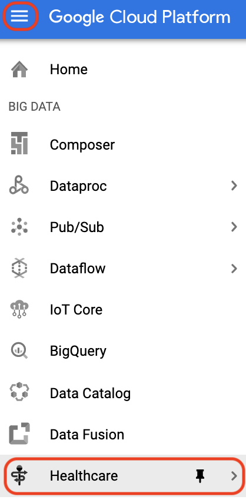
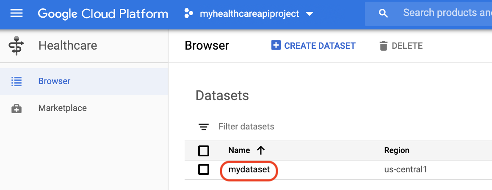
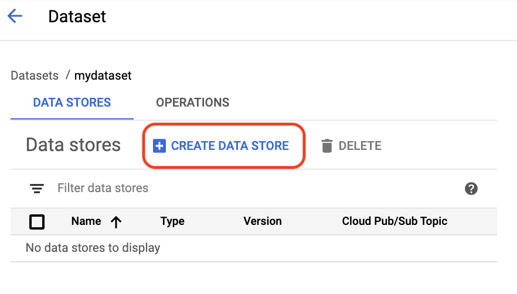
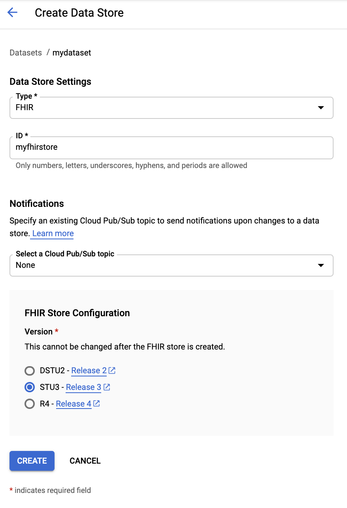

# Using Cloud Healthcare API with FHIR health record data

_This is an sample from a Google Cloud [tutorial](https://github.com/8bitmp3/Google-Cloud-Tutorial-Using-Cloud-Healthcare-API-with-FHIR-health-record-data/blob/master/Google-Cloud-Tutorial-Using-Cloud-Healthcare-API-with-FHIR-health-record-data.md) I wrote when learning how to use the Cloud Healthcare API._

Cloud Healthcare API is a platform-as-a-service (PaaS) that supports formats and protocols that are native to the healthcare industry. And, because data security is paramount in healthcare, the API covers identity management, network security, audit logging, storage and encryption, among other features. [Cloud Healthcare API](https://cloud.google.com/healthcare/docs) fills the gap between the healthcare sector's existing infrastructure and cloud services, such as Google Cloud, by providing a managed solution for both storing and accessing healthcare data.


> There are mainly three types the healthcare industry works with: [FHIR](https://cloud.google.com/healthcare/docs/concepts/fhir), [HL7v2](https://cloud.google.com/healthcare/docs/concepts/hl7v2) or [DICOM](https://cloud.google.com/healthcare/docs/concepts/dicom). 
>
> FHIR, for example, is a very extensible data model. It is also a graph, which allows for graph-based querying and other technology use to work against that kind of data. And, FHIR is an API specification, which allows it to be not only labeling and training data—as in the case of machine learning—but also a [transactional target](http://www.hl7.org/implement/standards/fhir/http.html#transaction).

This [tutorial](https://github.com/8bitmp3/Google-Cloud-Tutorial-Using-Cloud-Healthcare-API-with-FHIR-health-record-data/blob/master/Google-Cloud-Tutorial-Using-Cloud-Healthcare-API-with-FHIR-health-record-data.md) shows how to work with the data type called Fast Healthcare Interoperability Resources or [FHIR](https://cloud.google.com/healthcare/docs/concepts/fhir).

### Contents:

- Introduction
- Overview of Cloud Healthcare API
    - Platform-as-a-Service
    - Projects, datasets, and stores
    - BigQuery and Cloud Storage integration
    - Cloud Pub/Sub integration
- Activate Cloud Shell
- Start a new project
- Enable Cloud Healthcare API
- Create a FHIR dataset and a data store with Cloud Healthcare API
- Create a Cloud Storage bucket
- Set up IAM permissions
- Import a FHIR dataset to Cloud Storage
- Ingest the FHIR dataset to the data store
- Explore the dataset with BigQuery
- Additional sources for learning

See this [link](https://github.com/8bitmp3/Google-Cloud-Tutorial-Using-Cloud-Healthcare-API-with-FHIR-health-record-data/blob/master/Google-Cloud-Tutorial-Using-Cloud-Healthcare-API-with-FHIR-health-record-data.md) for the full tutorial.

---
(An extract from the tutorial)

### Projects, datasets, and stores

Cloud Healthcare API is an API service, where you have a hierarchy ranging a **[project](https://cloud.google.com/healthcare/docs/concepts/projects-datasets-data-stores#projects)** to a **[dataset](https://cloud.google.com/healthcare/docs/concepts/projects-datasets-data-stores#datasets_and_data_stores)** (such as clinical images or messages) and, finally, to a **[data store](https://cloud.google.com/healthcare/docs/concepts/projects-datasets-data-stores#datasets_and_data_stores)**, which implements the API's modalities.

To demonstrate the hierarchy, let's take a look at a REST path to the API:

```HTML
https://healthcare.googleapis.com/<V>/projects/<P>/locations<L>/
datasets/<D>/<type>Stores/<S>
```

---

(An extract from the tutorial)

## Create a FHIR dataset and a data store with Cloud Healthcare API

Having created a project and enabled Cloud Healthcare API, the next steps are to create a dataset and a data store for your FHIR data.

> **Attention:** Consider local healthcare regulations about where to store the data and colocation of the healthcare dataset(s) to the data source, Cloud Storage bucket(s) and BigQuery dataset(s). A full list of considerations can be found in [documentation](https://cloud.google.com/healthcare/docs/concepts/regions#location_considerations).

### In Cloud Console

- Click on the **Navigation Menu** and under **Big Data** go to **Healthcare**:

<center></center>

- Select **Create Dataset**:

<center></center>

- Name the dataset. In this example, you will be using "**mydataset**".

- Choose a data center region for your project where Cloud Healthcare API is available (see the [full list of available locations](https://cloud.google.com/healthcare/docs/concepts/regions)). In this tutorial, you will be using `us-central1` (based in Iowa, USA).

<center></center>

- Click **Create**. 

- In the Cloud Healthcare panel you should see the name of your newly-created dataset—**"mydataset"**—under Datasets. Click on its name:

<center></center>

- You are now in **Dataset** > **Data Stores** view. Select **Create Data Store**:

<center></center>

- Under **Data Store Settings**:
    - Select type **FHIR**. 
    - Choose a unique ID, such as "**myfhirstore**" (only numbers, letters, underscores, hyphens, and periods are allowed).

- Under **FHIR Store Configuration**, select **STU3**.

> **Note:** The FHIR version of a FHIR store can be DSTU2, STU3, or R4. You can read about STU3 [here](https://www.hl7.org/fhir/STU3/) and its version history [here](https://www.hl7.org/fhir/history.html) on the Health Level Seven International (HL7) website.

- Your configurations should look as follows:

<center></center>

- Click **Create** and notice that your new data store is now listed in the panel.

### In Cloud Shell

- To create a dataset use the `gcloud beta healthcare datasets create` [command](https://cloud.google.com/sdk/gcloud/reference/healthcare/datasets/create). You should specify the region where the data will be stored with the `--location` argument. In this example, the name is `mydataset` and region—`us-central1`:

```bash
gcloud beta healthcare datasets create mydataset \
    --location=us-central1
```

- You should see `Created dataset [mydataset]` in the output. Next, create a data store for your FHIR data using the `gcloud beta healthcare fhir-stores create` [command](https://cloud.google.com/sdk/gcloud/reference/beta/healthcare/fhir-stores/create) with a `--dataset` argument for the Cloud Healthcare dataset (`mydataset`). The name of the store in this example is `myfhirstore`:

```bash
gcloud beta healthcare fhir-stores create myfhirstore \
    --dataset=mydataset \
    --version=stu3
```

- It may take a few minutes to finish. Your output should say `Created fhirStore [myfhirstore]`.

> **Note**: You can find full documentation on creating and managing datasets with Cloud Healthcare [here](https://cloud.google.com/healthcare/docs/how-tos/datasets). For more on FHIR stores, see this [page](https://cloud.google.com/healthcare/docs/how-tos/fhir).

| Argument   | Description                            | Example                   |
| ---------- | -------------------------------------- | ------------------------- |
| `<V>`      | Healthcare API version                 | v1, v1beta1               |
| `<P>`      | Project identifier                     | myhealthcareapiproject    |
| `<L>`      | Data location storage identifier       | us-central1               |
| `<D>`      | Dataset identifier                     | mydataset                 |
| `<type>`   | Data type slug identifier              | fhir, hl7v2, dicom        |
| `<S>`      | Store identifier                       | myfhirstore               |

(_For the full tutorial on Using Cloud Healthcare API with FHIR health record data, click [here](https://github.com/8bitmp3/Google-Cloud-Tutorial-Using-Cloud-Healthcare-API-with-FHIR-health-record-data/blob/master/Google-Cloud-Tutorial-Using-Cloud-Healthcare-API-with-FHIR-health-record-data.md)._)
